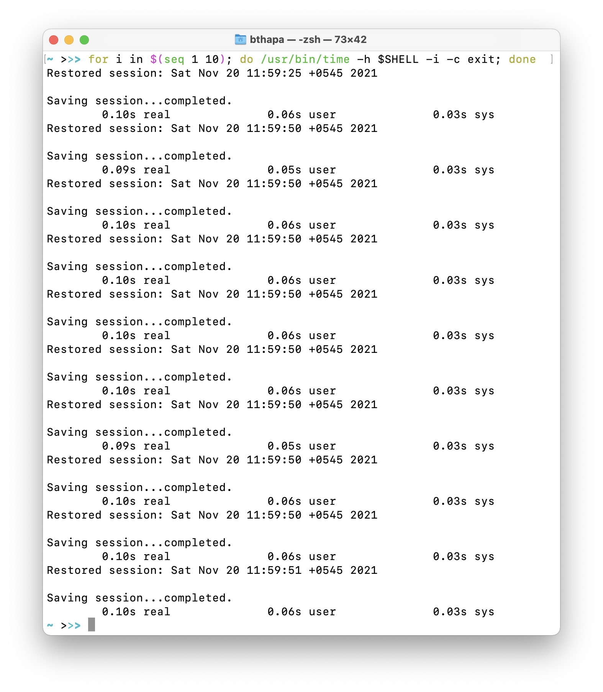

# dotfiles

## Dependencies

### Common Dependencies

- [aws-cli](https://aws.amazon.com/cli/)
- [golang](https://golang.org)
- [kube-ps1](https://github.com/jonmosco/kube-ps1)
- [kubectl-krew](https://github.com/kubernetes-sigs/krew)
- [kubectl-ksd](https://github.com/ashleyschuett/kubernetes-secret-decode)
- [nvm](https://github.com/nvm-sh/nvm)
- [pyenv](https://github.com/pyenv/pyenv)
- [z](https://github.com/rupa/z)
- [zsh](https://www.zsh.org)

### Linux Specific Dependencies

- [i3](https://i3wm.org)

### OSX Specific Dependencies

- [slate](https://github.com/jigish/slate)

### ZSH startup time
